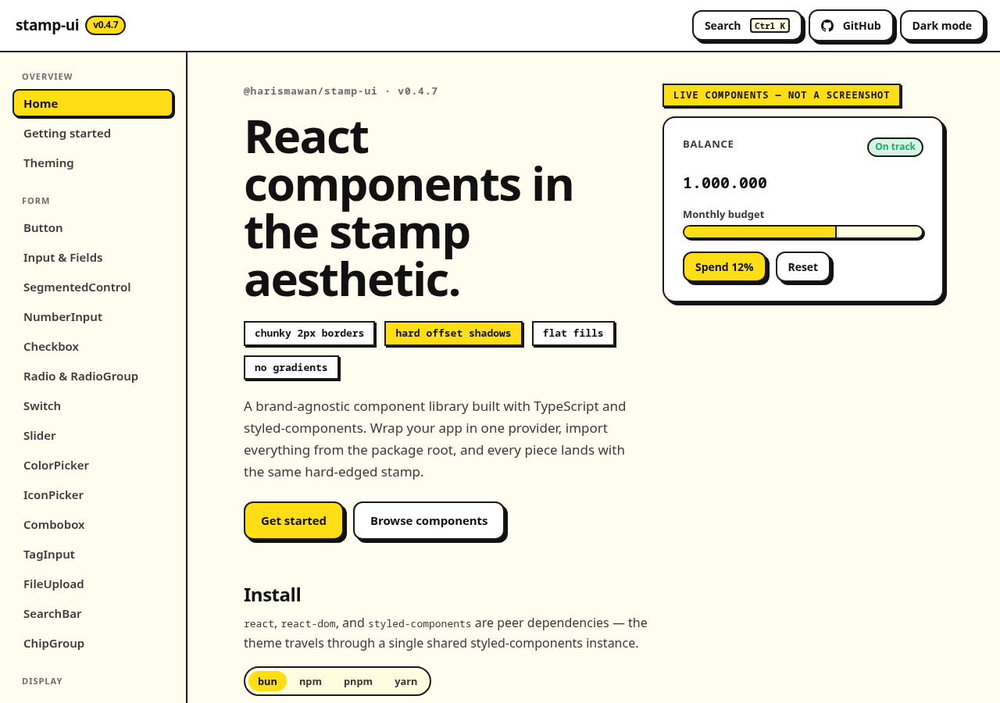

# @harismawan/stamp-ui

[](https://www.npmjs.com/package/@harismawan/stamp-ui)
[](./LICENSE)

A brand-agnostic React component library in the **"stamp" aesthetic** — chunky 2px
borders, hard offset shadows, flat fills, no gradients. Built with TypeScript +
styled-components.

**[Live gallery](https://stamp-ui.harismawan.com)** · **[Component reference](./USAGE.md)**

[](https://stamp-ui.harismawan.com)

## Install

```bash
bun add @harismawan/stamp-ui
# peers (provide your own):
bun add react react-dom styled-components
```

`react`, `react-dom`, and `styled-components` are **peer dependencies** — the
library expects a single shared instance of each (the theme is delivered through
styled-components' `ThemeProvider`).

## Quick start

Wrap your app in `StampProvider` (it sets up the theme + global styles), then use
components anywhere:

```tsx
import { StampProvider, Button, Card, CardTitle, CardValue } from '@harismawan/stamp-ui';

export function App() {
  return (
    <StampProvider mode="light">
      <Card>
        <CardTitle>Hello</CardTitle>
        <CardValue>stamp-ui</CardValue>
      </Card>
      <Button $variant="primary">Click me</Button>
    </StampProvider>
  );
}
```

## Theming

The library ships a default palette. Rebrand by passing your own theme (it must
satisfy the exported `Theme` type) to `StampProvider`:

```tsx
import { StampProvider, lightTheme, type Theme } from '@harismawan/stamp-ui';

const myTheme: Theme = { ...lightTheme, colors: { ...lightTheme.colors, primary: '#3B82F6' } };

<StampProvider theme={myTheme}>{/* ... */}</StampProvider>;
```

Light/dark mode is managed by the built-in `useThemeStore` (persisted). Omit
`mode` on `StampProvider` to let the store drive it.

## Components

- **Form:** `Button`, `ButtonGroup`, `Input`/`Select`/`Textarea`/`FieldWrap`/`FieldLabel`/`FieldError`, `NumberInput`, `Checkbox`, `Radio`/`RadioGroup`, `Switch`, `Slider`, `ColorPicker`, `IconPicker`, `Combobox`, `TagInput`, `FileUpload`, `SearchBar`, `ChipGroup`
- **Display:** `Card`, `Badge`, `Tag`, `Kbd`, `Avatar`/`AvatarGroup`, `Stat`, `EmptyState`, `Divider`, `Progress`, `Spinner`, `Skeleton`/`SkeletonText`/`SkeletonCircle`/`SkeletonGroup`, `Table` primitives, `DataTable`, `TreeView`, `PriceTag`, `Rating`, `RankList`, `GoalProgress`
- **Media & commerce:** `MediaCard`/`MediaCardCover`/`MediaCardBadge`/`MediaCardBody`, `MediaGallery`, `Carousel`, `AvatarFrame`
- **Pickers & palette:** `Calendar`, `DatePicker`, `DateRangePicker`, `Command`
- **Overlays:** `Modal`, `Drawer`, `ConfirmDialog` (`confirmDialog`/`ConfirmViewport`), `Toast` (`toast`/`ToastViewport`), `Tooltip`, `Popover`, `Menu`/`MenuButton`/`MenuList`/`MenuItem`, `Alert`, `FilterSheet`/`FilterSection`
- **Disclosure & nav:** `Tabs`, `Accordion`, `Breadcrumb`, `Pagination`, `Stepper`, `TopNav`/`TopNavLinks`/`TopNavActions`, `SideNav`/`SideNavSection`/`SideNavItem`
- **Layout:** `Box`, `Stack`/`HStack`/`VStack`, `Grid`, `Container`, `Footer`/`FooterColumn`, `VisuallyHidden`
- **Hooks:** `useThemeStore`, `useDisclosure`, `useClickOutside`
- **Utilities:** `startOfMonth`, `addMonths`, `isSameDay`, `isBefore`, `isAfter`, `isWithin`, `monthLabel`

## Development

```bash
bun install
bun test            # unit + a11y tests (happy-dom + @testing-library/react)
bun run typecheck   # tsc --noEmit
bun run build       # tsc -> dist/ (ESM + .d.ts)
bunx vite --config example/vite.config.ts example   # visual gallery of every component
```

## Publishing

Releases publish on a `v*` git tag via `.github/workflows/release.yml`, using npm
[trusted publishing](https://docs.npmjs.com/trusted-publishers) (OIDC) — no token
secret required.

## License

MIT
